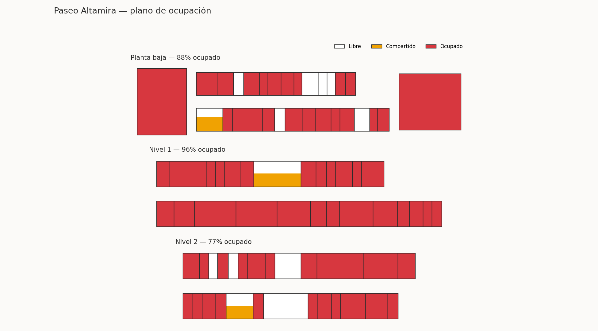
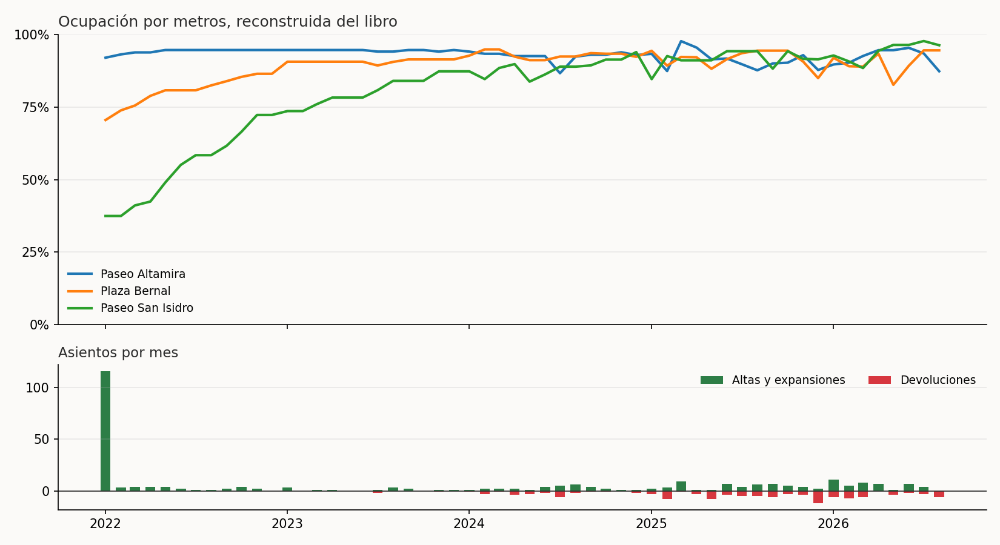

# Retail Space Manager — Occupancy as an Append-Only Ledger

> Leasing system for shopping-centre space: floor plan, availability, tenants
> and history. **Releasing a unit never deletes anything** — it posts a
> negative-square-metre entry. Occupancy is the running sum, so the history and
> the current state cannot drift apart.

   

> [!IMPORTANT]
> **Rebuild of a production R/Shiny app, on synthetic data.** The original runs
> inside a Mexican real-estate group against Snowflake. This repository keeps
> the data model and the business rules, rebuilt in Python, over a **generated**
> market — no plaza, brand, tenant or contract here is real, and no real record
> was anonymized to produce them. Every figure below describes this synthetic
> dataset and nothing else.

**▶ Live demo: <https://retail-space-manager.streamlit.app>** — *first load may take ~40s while the free instance wakes up.*



---

## The problem

A leasing team needs four answers, all day, about three shopping centres:

- **What is free right now, and how many square metres?**
- **Who is in unit PB-014, and under which contract?**
- **Register a new tenant / expand one / hand a unit back.**
- **When did this tenant move in, and when did the previous one leave?**

The original system answered all four from Excel-backed tables, then from a
Shiny app on Snowflake. It got two things right that most inventory systems get
wrong, and those two are what this repository is about.

### 1 · A unit is not occupied or free — it is occupied by *how much*

A 300 m² unit can hold two tenants behind one shopfront, or one tenant on 180 m²
with 120 m² still to lease. A boolean `occupied` column cannot express that, and
once the model is boolean the reports are wrong forever. Here every unit tracks
**square metres**, and *partial* falls out of the arithmetic instead of being a
third state somebody has to maintain.

### 2 · Handing back a unit is an event, not an undo

The original never issued a `DELETE` or an `UPDATE`. To release space it
inserted a row with **negative square metres**. That one decision is why the
history tab exists at all.

---

## The ledger

```
occupied(unit)   = Σ entries for that unit
available(unit)  = total m² − occupied(unit)
state at date D  = Σ entries with date ≤ D
```

That is the whole model. Three consequences make it worth defending:

**History is not a log somebody has to remember to write.** It *is* the ledger.
It cannot fall out of sync with the current state, because the current state is
derived from it. There is no `current_occupancy` table to reconcile.

**Any past date is a query, not an investigation.** "What was in unit 014 in
March 2023?" is a filter. The demo has a date slider that redraws the floor plan
for any month since January 2022 — no historical snapshots, no audit table.

**A mistake is corrected by a compensating entry, not by editing the past.**
Both entries stay visible. This is how accounting has worked for six centuries
and it is the right shape for anything a regulator or an auditor might ask about.

The price is that **validation has to happen at write time**, because afterwards
there is nowhere to fix it. That is the single biggest difference from the system
this is modelled on.

---

## What changed from the original

Three defects found while porting. Each one is now a test.

### The release path never checked the balance

The original built the release like this:

```r
# read the tenant name, then post the negative — with no check that
# the contract actually holds those metres in that unit
query_insert <- sprintf(
  "INSERT INTO OCCUPANCY_LEDGER (...) VALUES ('%s','%s',%.2f,'%s',...)",
  id_comercial, id_local, -abs(metros_a_liberar), cliente, ...)
```

Renting validated available space. Releasing did not. Hand back 200 m² from a
100 m² tenancy and the unit ends up with *negative* occupancy, quietly, and the
availability report is wrong from then on. Worse with two tenants sharing a
unit: one of them can release the other's square metres.

Here, `Libro.asentar` refuses both, by contract and by unit:

```python
if m2 > 0:
    if m2 > self.disponible(id_local) + EPS:
        raise AsientoInvalido(...)      # does not fit
else:
    if abs(m2) > self.saldo_contrato(id_contrato, id_local) + EPS:
        raise AsientoInvalido(...)      # not yours to give back
```

### A multi-unit contract could be posted half-way

Leases routinely cover two or three adjacent units. In the original each unit
was a separate `INSERT` in a loop, so a failure on the third left the first two
posted — and nobody found out until billing did not reconcile. Here a
multi-unit posting is **rehearsed on a copy first**: if any leg fails, none is
written.

### Contract ids were built by concatenating unit numbers

The original id looked like `PB-014_PB-016_8231`: the units joined together plus
a random number, checked against the database for collisions. Three problems —
it is unreadable, it *changes meaning* when the tenant expands into another
unit, and the check-then-insert is a race between two clerks. Replaced by a
readable sequence per centre and year, `PALT-2026-0007`, which keeps its
identity through expansions.

### And one more, found by the tests

Client names went into SQL through `sprintf`. A tenant called `Café O'Brien`
closes the string literal. There is a parametrized test for exactly that, plus
four other names that break naive concatenation.

---

## A chart that does not draw is a test you do not have

The floor plan shipped to production **invisible**. One layer set `axis=None`
and another left the axis at its default; merging them, Vega-Lite threw
`Cannot read properties of undefined` inside `parseAxesAndHeaders` and drew
nothing.

Nothing in Python noticed. Streamlit's `AppTest` runs the script, and the script
ran fine — building a chart object always succeeds. **The failure happens in the
browser**, which no Python test was looking at.

So `tests/test_graficas.py` compiles every chart with `vl_convert`, the same
Vega-Lite the browser runs, and asserts a real PNG comes out:

```python
def _dibuja(grafica):
    return len(vlc.vegalite_to_png(grafica.to_json(), scale=1))
```

Seven tests: the plan at every level of all three centres, the plan of an
*empty* centre on day one of the ledger, the occupancy series, the turnover
bars, and both tenant charts. The bug that reached production now fails in
eleven seconds locally.

---

## The data

Generated, not anonymized.

| | |
|---|---|
| Shopping centres | 3 (opened 2019, 2021 and 2022) |
| Units | 157, including 5 anchor boxes |
| Leasable area | 26,273 m² |
| Ledger | 406 entries, Jan 2022 → Aug 2026 |
| Contracts | 221 · 128 active · 93 closed |
| Tenants | 83 fictional brands across 11 categories |

The generator does not write the ledger directly — **it calls the same API the
app calls** (`Libro.alta`, `.expansion`, `.baja_total`). If an invariant breaks,
the data cannot be generated at all. It is the cheapest smoke test available.

Each centre has its own lease-up curve, counted from **its own opening year**:



Paseo Altamira was already mature when the ledger starts, so January 2022 is a
migration of the state it already had. Paseo San Isidro opens that month and
fills over three years. **The three do not move in the same direction:**

| | Jun 2023 | Today | |
|---|---|---|---|
| Paseo Altamira *(opened 2019)* | 97.4% | 87.3% | leases expiring faster than they re-let |
| Plaza Bernal *(2021)* | 95.4% | 94.5% | steady |
| Paseo San Isidro *(2022)* | 79.7% | 96.3% | still filling |

The aggregate barely moves, which is exactly why the aggregate is the wrong
number to manage by. Neither centre ever reaches 100% — one unit is always
under fit-out or between tenants, and a dashboard showing 100% is lying.

---

## Measured, not asserted

`python scripts/run_demo.py` runs the pipeline and checks 25 assertions. A few
worth naming:

| | |
|---|---|
| Current occupancy by area | **91.3%** |
| Vacate the largest anchor → occupancy by **area** falls | **5.0 pp** |
| …and occupancy by **unit count** falls | 0.6 pp — *eight times less* |
| Shared units (two tenants, one unit) | 3 |
| State vs. sum of the ledger | max gap **0.000 m²** |
| Units over their own area | 0 |
| Median closed-lease duration | 1,221 days |

**Occupancy is reported by square metres, not by unit count**, and that last
pair is why. Empty the 1,311 m² anchor and the area figure moves five points
while the unit count barely twitches — the unit count cannot see the hole. Both
numbers are shown in the app, precisely so the gap is visible when it opens.

The assertions that matter most are the ones about the ledger itself: entry
numbers are gapless, no entry is dated before the one before it, every closed
contract nets to exactly zero, and the state recomputed from the raw entries
matches the state the app displays — today and at any past cut-off.

---

## Running it

```bash
pip install -r requirements.txt

python scripts/run_demo.py          # 25 assertions
streamlit run app/gestor.py         # the app

pip install -r requirements-dev.txt
pytest -q                           # 50 tests
```

**No credentials, no database, no environment variables.** The app generates its
world at startup and keeps the ledger in session state, so anyone can post
entries in the demo without touching anyone else's.

### Layout

```
src/plaza.py             unit catalogue + floor-plan geometry
src/libro.py             the append-only ledger — the core
src/ocupacion.py         state derived from the ledger
src/plano.py             the floor plan, in Altair
src/generar_historia.py  4½ years of synthetic movement
app/gestor.py            Streamlit: plan · rent · release · history
tests/test_graficas.py   every chart, compiled with the browser's Vega-Lite
```

`src/libro.py` is the file to read first. Everything else derives from it.

---

## Honest limits

**The ledger is recomputed, not materialized.** Every view sums the entries.
With tens of thousands of rows that is milliseconds in pandas; at a hundred
million it needs a materialized view refreshed on write. The design does not
change — what changes is where the sum is cached. Maintaining the state by hand
is not the alternative; it is the bug.

**Entries cannot be back-dated.** That is deliberate, and it is what a ledger
means, but it does mean a lease signed on the 1st and captured on the 8th is
recorded on the 8th. The clean fix is two dates per entry — when it happened and
when it was posted — which is what a production version should carry.

**Unit geometry is a rectangle.** Real leasing plans are irregular polygons from
CAD. Rectangles are enough to show occupancy and keep the plan honest (the
rectangle's area *is* the leasable area), but a real deployment would read the
actual polygons — which is what
[`property-portfolio-geo`](https://github.com/chino-bot1701/property-portfolio-geo)
does with WKT and geodesic areas.

**No money.** Rents, escalations and recoveries are the obvious next layer, and
the ledger is the right place for them: a rent change is another entry.
